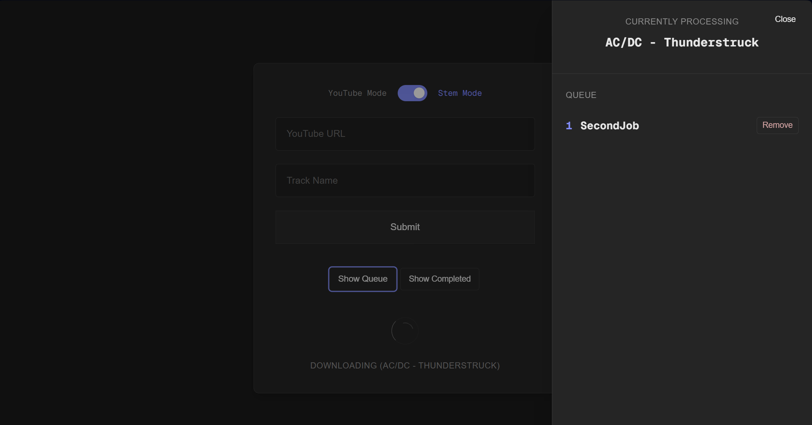

# YouTube to Stems & MP3 Web App

## Project Purpose
A local web application for music producers to seperate songs on youtube into 4-stem audio tracks (drums, bass, vocal, other) or a simple youtube to mp3 conversion.

## Demo

 - Main Page with entry form and toggle for youtube mode (just .mp3) or stem splitter


 - Job queue to prepare multiple jobs at once. I set up 3+ and leave for a good while while they work


 - All completed jobs show on this sidebar. Shows the waveform for each audio track, the songs BPM, and the songs key


## Getting Started

1. **Clone the repository**
   - Open a terminal and run:
     ```
     git clone https://github.com/dthoshaw/yt_to_stems.git
     cd <Path_To_Folder>
     ```

2. **Install dependencies**
    - Make sure you have Python 3.9+ and Next.js installed.
    - (Optional/Recommended) Create and activate a virtual environment:
       ```
       python -m venv venv
       # On Windows:
       venv\Scripts\activate
       # On Mac/Linux:
       source venv/bin/activate
       ```
    - Install Python dependencies:
       ```
       pip install -r requirements.txt
       ```
    - Install Next.js dependencies as needed.

3. **Run the app**
   - Use the provided `start.bat` script (Windows) to launch both the backend and frontend.
   - Double-click `start.bat` or run it from a terminal:
     ```
     start.bat
     ```
   - Use the provided 'startMacOS.sh' script for MacOS:
     ```
     startMacOS.sh
     ```

4. **Usage**
   - Open your browser and go to `http://localhost:3000` (or the port shown in the terminal).
   - Use the toggle to select YouTube mode (just mp3) or Stem mode (full separation).
   - Paste a YouTube URL and enter a track name, then submit.
   - Download YouTube audio as mp3 or split into stems.


## Notes
- For best results, use short YouTube tracks (under 6 minutes).
- All processing is local; no data is sent to external servers.
- For troubleshooting, check the terminal output for errors.
- All jobs and files are stored in the `temp_jobs` folder.


**To start the app, always use the 'start' script!**
